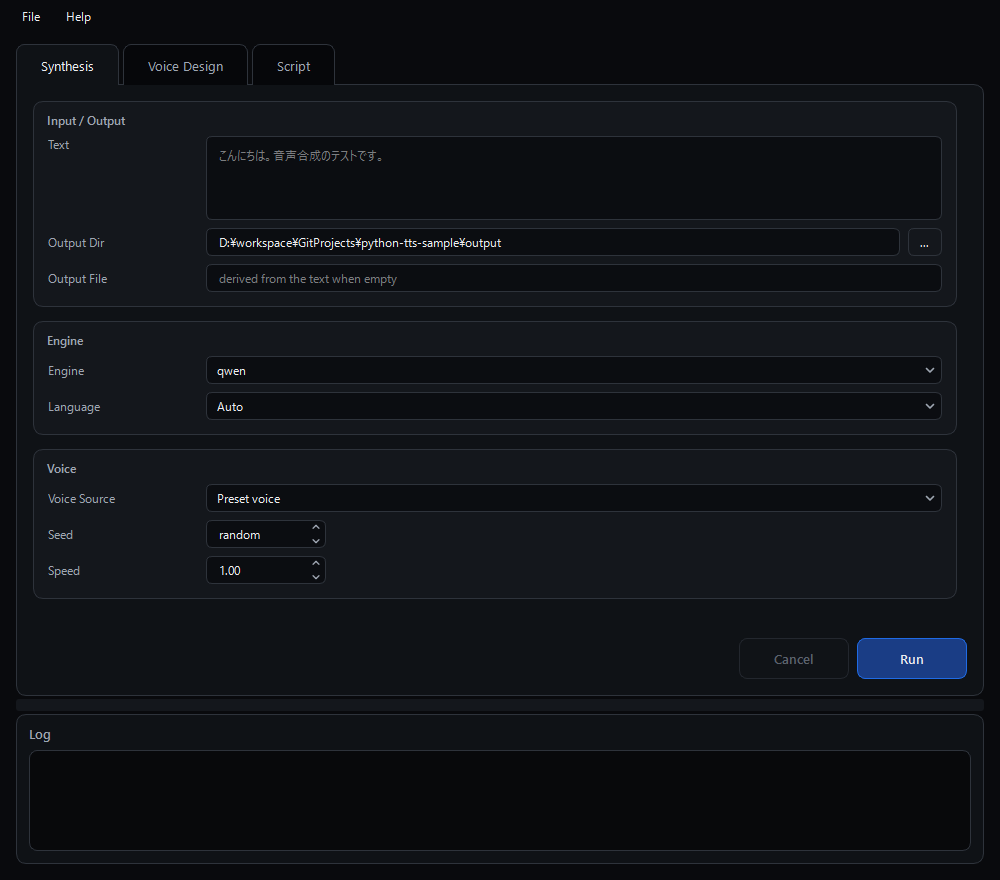
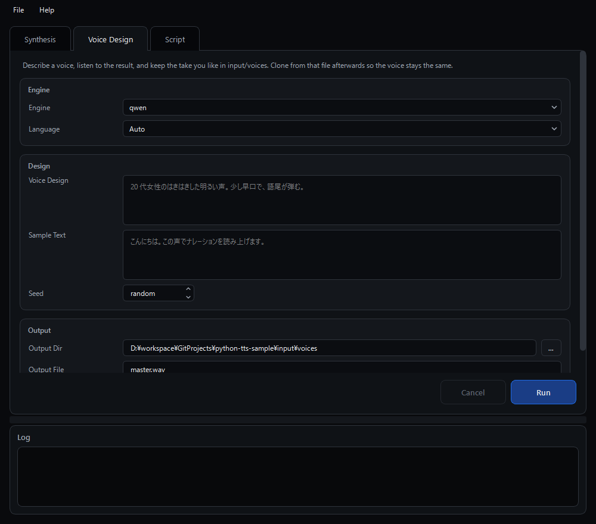
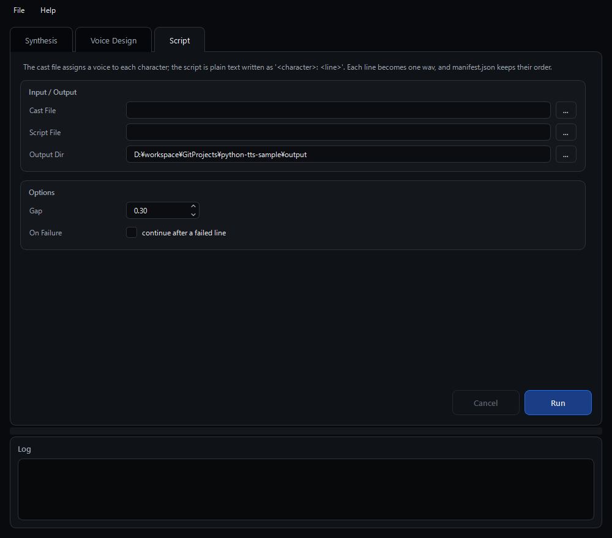

# TTS Toolkit

**ローカルで動く 3 つの音声合成モデルを、同じ画面・同じコマンドで使えるようにしたツール** です。（Windows）

Qwen3-TTS / Chatterbox / Irodori-TTS は依存ライブラリが互いに排他的で、1 つの仮想環境には同居できません。  
そこでモデルごとに仮想環境を分け、**GUI / CLI からは同じ呼び方で切り替えられる**ようにしています。

| モデル                                                                  | 得意なこと                                       |
| ----------------------------------------------------------------------- | ------------------------------------------------ |
| [Qwen3-TTS](https://github.com/QwenLM/Qwen3-TTS) 1.7B                   | 日英とも高品質。3 秒の参照音声から声を複製できる |
| [Chatterbox](https://github.com/resemble-ai/chatterbox) Multilingual V3 | 0.5B と軽く、23 言語に対応                       |
| [Irodori-TTS](https://github.com/Aratako/Irodori-TTS) v4.1 Small        | 日本語専用・48kHz。文章で声を作り込める          |

| できること                                                                   | 出力                     |
| ---------------------------------------------------------------------------- | ------------------------ |
| **テキストから音声を作る** — 1 件ずつ、または台本からまとめて                | `.wav`                   |
| **参照音声から声を複製する** — 数秒〜の音声を真似る（ゼロショットクローン）  | `.wav`                   |
| **文章で声を設計する** — 「落ち着いた低めの女性の声」から声そのものを作る    | `.wav`                   |
| **キャラクター台本の一括合成** — 台詞ごとの wav と尺・並び順の記録を書き出す | `.wav` + `manifest.json` |



---

## 1. 必要環境

| 項目     | 内容                                                                                       |
| -------- | ------------------------------------------------------------------------------------------ |
| OS       | Windows 11（セットアップと起動のスクリプトは Windows 用）                                  |
| ツール   | **mise / uv / git**                                                                        |
| Python   | **3.12 に固定**（mise が入れます。→ [docs/setup/00_common.md](docs/setup/00_common.md)）  |
| GPU      | NVIDIA GPU（CUDA 12.8 以降を報告するドライバ）。VRAM 8GB 以上を推奨                        |
| ディスク | 30GB 以上の空き（仮想環境 4 つとモデルの重み。ダウンロードは 10GB を超えます）             |

GPU が無くても動きますが、量産に使える速度ではありません。

---

## 2. セットアップ

仮想環境（共通層 + エンジン 3 つ）を作って依存をインストールします。

```powershell
git clone <このリポジトリ>
cd python-tts-sample
pwsh scripts\win\setup_engines.ps1
```

初回はダウンロードが多く、数十分かかります。  
エンジンを絞る場合は `-Targets` を付けます（`common` / `qwen` / `chatterbox` / `irodori`）。

```powershell
pwsh scripts\win\setup_engines.ps1 -Targets common,irodori
```

終わったら、次のコマンドで確認します。3 エンジンとも `CUDA ok` と出れば準備完了です。

```powershell
.\.venvs\common\Scripts\python.exe -m ttstoolkit.cli doctor
```

mise / uv が未導入の場合や、エンジンごとの詳しい手順・トラブルシュートは
**[docs/setup/](docs/setup/README.md)** を参照してください。

---

## 3. 使い方

### 起動する

```powershell
scripts\win\LaunchApp.bat
```

画面は上下 2 段で、上が入力タブ、下がログです。境目はドラッグで動かせます。

| タブ         | すること                                 |
| ------------ | ---------------------------------------- |
| Synthesis    | テキストを 1 件合成する                  |
| Voice Design | 文章から声を作り、`input/voices/` に残す |
| Script       | キャスト定義と台本からまとめて合成する   |

### 参照音声を用意する

声を複製したいときは、参照音声を `input\voices\` に置くと、ファイル選択ダイアログが最初にそこを開きます。  
手元に無い場合は、下の **Voice Design タブ**で文章から作れます。

参照音声の長さの目安は、Qwen / Chatterbox が 3 秒程度から、Irodori は 30 秒以上を推奨（上限 120 秒）です。

### Synthesis タブ — テキストを 1 件合成する

**テキストを読み上げた wav を 1 本書き出す機能** です。

`Text` を書き、使う `Engine` を選んで `Run` を押します。

#### Input / Output

| 項目        | 既定値    | 説明                                                             |
| ----------- | --------- | ---------------------------------------------------------------- |
| Text        | 未入力    | 読み上げるテキスト                                               |
| Output Dir  | `output/` | 書き出し先。`...` を押すと選択できます                           |
| Output File | 空        | 書き出すファイル名。空ならテキストから決まる名前で書き出します   |

#### Engine

| 項目     | 既定値 | 説明                                                                |
| -------- | ------ | ------------------------------------------------------------------- |
| Engine   | `qwen` | 使うエンジン。`qwen` / `chatterbox` / `irodori`                     |
| Language | `Auto` | 言語。`Japanese (ja)` / `English (en)`。Auto ならエンジンに任せます |

エンジンごとに対応している機能が違います。

|            | 日本語 |  英語  | 声クローン | Voice Design | 話速 | シード | レート |
| ---------- | :----: | :----: | :--------: | :----------: | :--: | :----: | -----: |
| qwen       |   ○    |   ○    |     ○      |      ○       |  ×   |   ○    | 24 kHz |
| chatterbox |   ○    |   ○    |     ○      |      ×       |  ×   |   ○    | 24 kHz |
| irodori    |   ○    | **×**  |     ○      |      ○       |  ○   |   ○    | 48 kHz |

**対応していない指定は黙って無視されず、エラーになります。** エンジンを起動する前に判定するので、待たされません。

#### Voice

| 項目         | 既定値         | 説明                                                                       |
| ------------ | -------------- | -------------------------------------------------------------------------- |
| Voice Source | `Preset voice` | 声の決め方。下の表のとおり、選ぶと関係のない入力欄は消えます               |
| Seed         | `random`       | `random` のままだと毎回変わります。固定すると声がぶれにくくなります        |
| Speed        | `1.00`         | 話速（0.5〜2.0）。**Irodori のみ**。他のエンジンでは `1.00` のままにします |

| Voice Source                 | 出る入力欄                           | 説明                                                                                                        |
| ---------------------------- | ------------------------------------ | ----------------------------------------------------------------------------------------------------------- |
| `Preset voice`               | なし                                 | エンジンの既定の声。Qwen は言語ごとのプリセット話者を使います                                               |
| `Clone from reference audio` | `Reference Audio` / `Reference Text` | 参照音声の声を真似ます。`Reference Text`（音声の書き起こし）は **Qwen のみ**が使い、あると品質が上がります |
| `Design from a description`  | `Voice Design`                       | 文章で声を指定します（qwen / irodori）。例: 「落ち着いた低めの女性の声。丁寧で穏やかな話し方。」            |

`output\irodori-xxxxxxxxxxxx.wav` のような wav が書き出されます。

### Voice Design タブ — 文章で声を作る

**参照音声が無くても、声を文章で説明して作る機能** です。実在の人物に頼らずにキャラクターの声を作れます。



| 項目         | 既定値          | 説明                                                                   |
| ------------ | --------------- | ---------------------------------------------------------------------- |
| Engine       | `qwen`          | Voice Design に対応しているもの（qwen / irodori）だけが並びます        |
| Language     | `Auto`          | 言語                                                                   |
| Voice Design | 未入力          | 声と話し方の説明。例: 「20 代女性のはきはきした明るい声。少し早口。」  |
| Sample Text  | 未入力          | 試し読みさせる文                                                       |
| Seed         | `random`        | 固定すると同じ声を再現しやすくなります                                 |
| Output Dir   | `input/voices/` | 書き出し先。作った声をそのまま参照音声の置き場に残せます               |
| Output File  | `master.wav`    | 書き出すファイル名                                                     |

作った声は毎回わずかに揺れます。**気に入った 1 本を残して、以後はそれを複製する**のが安定した運用です。

1. `Voice Design` に声と話し方を、`Sample Text` に試し読みの文を書く
2. `Run` → `input/voices/master.wav` ができる
3. 気に入らなければ `Seed` を変えて繰り返す
4. 決まったら Synthesis タブで `Clone from reference audio` を選び、`master.wav` を指定する

作り込みのコツは [docs/guide/original-voice.md](docs/guide/original-voice.md) を参照してください。

### Script タブ — キャラクター台本からまとめて合成する

**キャラクターごとの声の定義と台本から、台詞をまとめて合成する機能** です。  
声の定義は一度書けば使い回せるので、毎回書くのは台詞だけです。



#### Input / Output

| 項目        | 既定値    | 説明                                                                         |
| ----------- | --------- | ---------------------------------------------------------------------------- |
| Cast File   | 未指定    | キャラクターごとの声の定義（`cast.toml`）。`...` で `input/script/` から選択 |
| Script File | 未指定    | 「話者: 台詞」を並べたテキスト。`...` で `input/script/` から選択            |
| Output Dir  | `output/` | 書き出し先。台詞ごとの wav と `manifest.json` が置かれます                   |

#### Options

| 項目       | 既定値 | 説明                                                                                    |
| ---------- | ------ | --------------------------------------------------------------------------------------- |
| Gap        | `0.30` | `manifest.json` の `start_sec` を出すときの台詞間の間（秒）。**wav に無音は足しません** |
| On Failure | OFF    | ON にすると、1 台詞が失敗しても残りを続けます                                           |

キャスト定義（`input/script/cast.toml`）と台本（`input/script/ep01.ja.txt`）は次のように書きます。

```toml
[voices."霊夢"]
engine = "irodori"
voice_design = "落ち着いた少女の声。淡々としていて、少し呆れたような話し方。"
language = "ja"
seed = 42
```

```
霊夢: 今日はいい天気ね。
魔理沙: そうだな、絶好の弾幕日和だぜ！
霊夢[speed=0.9]: ……また変なこと言ってる。
```

`output\ep01\001-霊夢.wav` のような台詞ごとの wav と、各台詞の尺と先頭からの秒数を記録した `manifest.json` が書き出されます。  
話者ごとに違うエンジンを割り当てても構いません（モデルのロードはエンジンごとに 1 回だけ）。

書き方の詳細は [docs/guide/script.md](docs/guide/script.md) を参照してください。

### 実行中の操作

- 合成は別スレッドで動くので、実行中も画面は固まりません（`Run` が無効になり、`Cancel` が有効になります）
- `Cancel` は**次の台詞に入る前**に止まります。1 件だけの合成は最後まで走ります
- 初回は、モデルの重みをダウンロードする確認ダイアログが出ます（数分・数 GB。1 回答えるとそのセッション中は出ません）
- 「Engine Not Set Up」と出たら、そのエンジンの仮想環境がまだありません。`scripts\win\setup_engines.ps1` を実行してください
- 進捗とエラーは下のログに流れます。行頭のラベル（`[info]` / `[warn]` / `[error]`）は CLI と同じで、`File > Clear Log` で消せます
- 成功すると出力フォルダがエクスプローラーで開きます
- ウィンドウの位置・サイズと入力値は終了時に保存され、次回起動時に戻ります
- `File > Clear Saved Settings...` で保存値を消去し、画面を既定値へ戻せます
- `Help > Open Document` でプロジェクトの GitHub ページを開けます

各項目の詳細は **[docs/gui/usage.md](docs/gui/usage.md)** を参照してください。

---

## 4. フォルダ構成

```
python-tts-sample/
├─ python/
│   └─ ttstoolkit/       GUI・CLI・処理をまとめたパッケージ
│       ├─ main.py           ← GUI の起点。-m ttstoolkit.main で起動する
│       ├─ tool_config.py    タイトル・サイズ・リソースのパス
│       ├─ definitions.py    画面に並べる選択肢（言語・声の決め方）
│       ├─ gui/              Model / View / Controller と画面部品
│       ├─ cli/              コマンドラインの入口（単一入口 + 各コマンド）
│       ├─ core/             CLI / GUI 共用の処理本体（親プロセス側）
│       └─ engine/           別の仮想環境で動く runner
│           ├─ _shared/          両側が守る契約（protocol）と runner の土台
│           └─ qwen/ chatterbox/ irodori/
├─ engine_env/         各エンジンの仮想環境を作るための定義
├─ .venvs/             仮想環境の実体（common と engine-*）
├─ resources/          スタイルシート（色とサイズは全部ここ）
├─ docs/               詳細ドキュメント
├─ input/              入力
│   ├─ voices/           参照音声を置く（中身は .gitignore 対象）
│   ├─ script/           キャスト定義と台本を置く
│   └─ batch/            バッチ用の JSON を置く
├─ output/             生成した wav（中身は .gitignore 対象）
├─ scripts/
│   └─ win/setup_engines.ps1 / LaunchApp.bat
├─ tests/              共通層のテスト（モデル不要）
├─ mise.toml           使う Python のバージョン (3.12) と uv の設定
└─ pyproject.toml      依存と Ruff の設定
```

すべての Python コードは `python/ttstoolkit/` にまとめています。  
共通層（`core`）は画面出力もプロセス終了もしない（進捗は `logging`、失敗は例外）ので、CLI と GUI が同じ API をそのまま呼べます。  
共通層はモデルを直接 import せず、エンジンごとの仮想環境にある runner をサブプロセスとして起動し、標準入出力の JSON でやり取りします。バッチや台本ではモデルをロードしたまま流すので、ロード時間は最初の 1 回だけです。

入出力の既定パスは**カレントディレクトリではなくリポジトリルート基準**で解決されるため、どこから実行しても結果は同じ場所（`output/`）に書き出されます。

なぜこの構成なのかは [docs/development/architecture.md](docs/development/architecture.md) を参照してください。

---

## 5. CUI で実行する

GUI と同じ処理をコマンドラインからも実行できます。  
リポジトリのルートで、共通層の Python（`.venvs\common`）を使って実行します。

```powershell
.\.venvs\common\Scripts\python.exe -m ttstoolkit.cli synth -e irodori -t "こんにちは。"
```

毎回書くには長いので、関数を 1 つ作っておくと楽です。以降は `tts` と書きます。

```powershell
function tts { & "$PWD\.venvs\common\Scripts\python.exe" -m ttstoolkit.cli @args }
```

```powershell
# ① 環境の確認・エンジン一覧
tts doctor
tts engines

# ② 1 件合成
tts synth -e qwen -t "こんにちは。" -l ja -O hello.wav

# ③ 参照音声から声を複製（Qwen は --reference-text があると高品質）
tts synth -e qwen -t "おはようございます。" -l ja -r master.wav

# ④ 文章で声を作る → 気に入った 1 本を残して、以後はそれを複製する
tts synth -e irodori -l ja --seed 42 `
    -t "こんにちは。この声でナレーションを読み上げます。" `
    --voice-design "20 代女性のはきはきした明るい声。少し早口。" `
    -o input\voices -O master.wav
tts synth -e irodori -l ja -r master.wav -t "今日も一日がんばりましょう。"

# ⑤ JSON をまとめて合成（GUI にはありません）
tts batch -e qwen sample.ja.json -o output\batch

# ⑥ キャラクター台本から
tts script ep01.ja.txt -c cast.toml -o output\ep01
```

参照音声・バッチ入力・台本は、ファイル名だけ書けば `input/voices/` / `input/batch/` / `input/script/` から探します。

GUI が画面に出していないもの（`batch`、`-f`（テキストをファイルから読む）、`-v`（エンジン自身の出力も見る）など）は CLI 側にあります。  
全オプションは `-h` で確認できます。

- [docs/cli/common_options.md](docs/cli/common_options.md) — 共通オプション・パスの解決・終了コード
- [docs/cli/synth.md](docs/cli/synth.md) — ②③④ 1 件合成
- [docs/cli/batch.md](docs/cli/batch.md) — ⑤ JSON をまとめて合成
- [docs/cli/script.md](docs/cli/script.md) — ⑥ キャラクター台本
- [docs/cli/engines.md](docs/cli/engines.md) / [docs/cli/doctor.md](docs/cli/doctor.md) — ① エンジン一覧・環境チェック

---

## 6. ドキュメント

詳しい仕様・オプション・実装の話は [docs/](docs/README.md) にあります。

|                                                                      |                                  |
| -------------------------------------------------------------------- | -------------------------------- |
| [docs/setup/](docs/setup/README.md)                                  | 導入手順（**最初に読む**）       |
| [docs/gui/usage.md](docs/gui/usage.md)                               | GUI の全オプション               |
| [docs/cli/](docs/cli/common_options.md)                              | CLI のコマンドごとの使い方       |
| [docs/guide/script.md](docs/guide/script.md)                         | キャラクター台本の書き方         |
| [docs/guide/original-voice.md](docs/guide/original-voice.md)         | オリジナルの声を設計して固定する |
| [docs/development/architecture.md](docs/development/architecture.md) | 全体構成と設計の根拠             |
| [docs/instructions/code_guide.md](docs/instructions/code_guide.md)   | コーディングルール               |

---

## 7. ライセンス

3 モデルともローカル生成は無料・無制限で、商用利用も可能です。

| モデル      | コード     | 重み                                     |
| ----------- | ---------- | ---------------------------------------- |
| Qwen3-TTS   | Apache-2.0 | Apache-2.0                               |
| Chatterbox  | MIT        | MIT（生成音声に PerTh 電子透かしが入る） |
| Irodori-TTS | MIT        | MIT                                      |

ただし**参照音声（声素材）の権利は別**です。実在の人物の声を複製する場合は、本人の同意と利用範囲の確認が必要になります。
